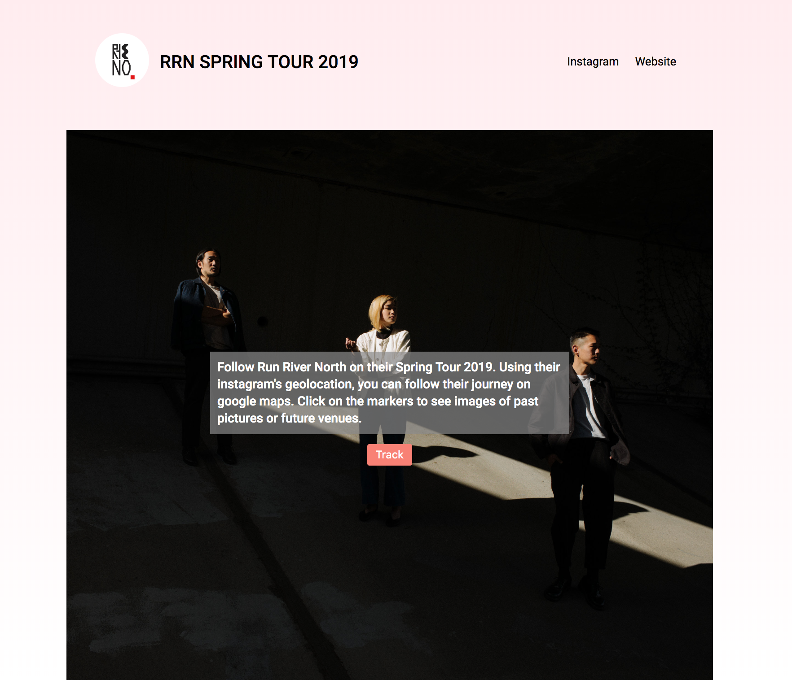
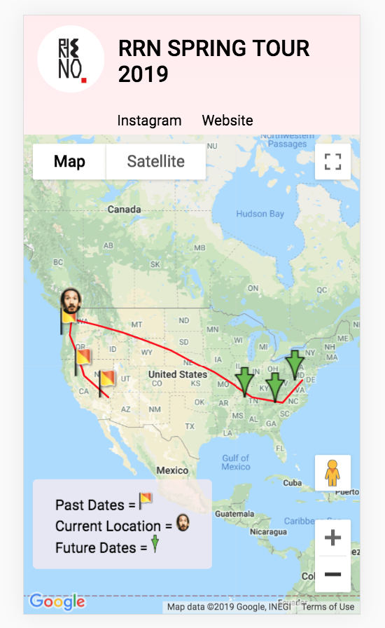
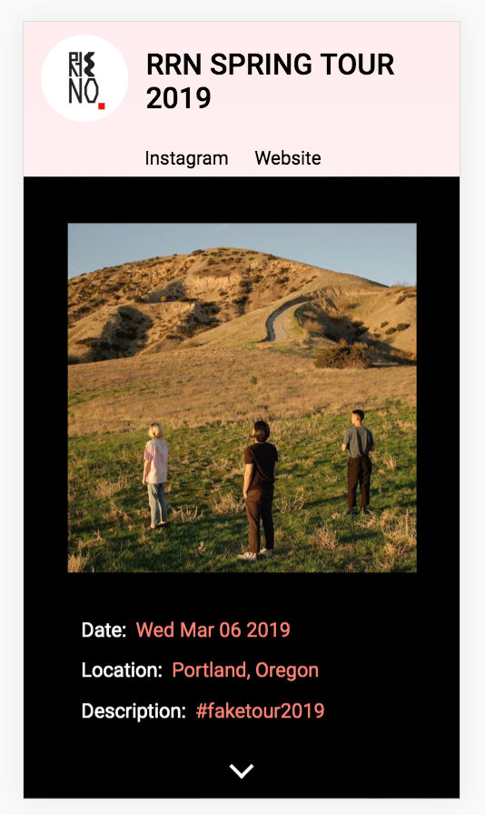

# RRN 

## Link

[https://gbertkim.github.io/RRN/](https://gbertkim.github.io/RRN/)

## Description

RRN is a project that was made for the band Run River North. In 2019, they will go on a Spring Tour. This app allows for the user to track their location via their most recent instagram posts and future concert dates. 

The project uses Instagram's API to get the geolocation and images of their post filtering for a certain hashtag. It then uses the Google API to create custom map markers. The project gives accessibility to the markers, which google does not provide, by giving them a tab-index.

Future concert dates are stored in an array. If today's date passes a specific concert date, the concert is removed from the Array. 

The project allows for the user to keep updated with their favorite band and buy tickets to shows. 

Instagram removed "locations" endpoint from their API. I had to manually enter image locations in order for this project to keep functioning. 

## Stack

HTML, CSS, JavaScript, Google API, and Instagram API

## Snapshots

Sample start page. Users are informed of what the app does and how to start tracking the band noted. 

Example of the map with markers formatted for the phone.

When a marker is clicked, a full width page slides up and the image is updated. When the down arrow is clicked, the page slides down and goes back to the map. 

